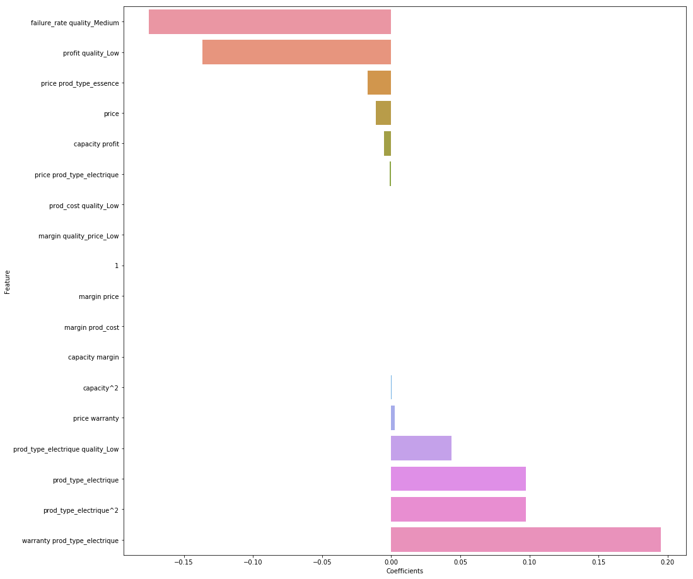
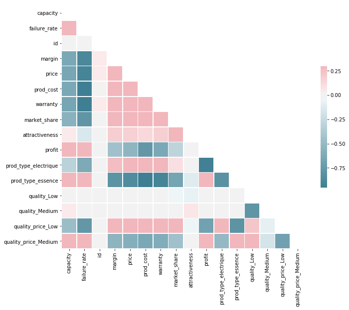
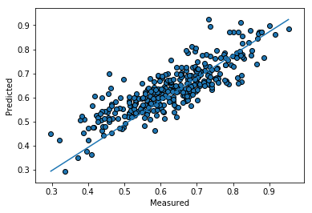

# MoowerMarket [](https://www.python.org/downloads/release/python-360/)

All is in the:
> notebook/Exploration Notebook

### Installation
MoowerMarket requires [Python 3.6](https://www.python.org/downloads/release/python-360/).
Install dependencies thanks to setup.py
```
$ python setup.py
```

### Features importance
<p align="center">
  
</p>

### Correlation
<p align="center">
  
</p>

### Pred vs True
<p align="center">
  
</p>

### Score
```
RMSLE: 0.041
RMSE: 0.066
Adjusted R²: 0.705
```

Submission file:
> data/submission/submission.csv

License
----
MIT

**Free Software !**
